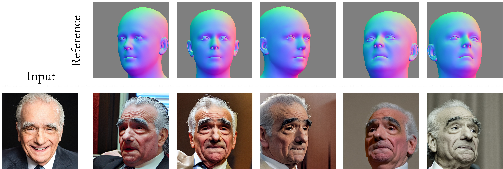

<div align="center">

# Arc2Face: A Foundation Model of Human Faces

[Foivos Paraperas Papantoniou](https://foivospar.github.io/) &emsp; [Alexandros Lattas](https://alexlattas.com/) &emsp; [Stylianos Moschoglou](https://moschoglou.com/)   

[Jiankang Deng](https://jiankangdeng.github.io/) &emsp; [Bernhard Kainz](https://bernhard-kainz.com/) &emsp; [Stefanos Zafeiriou](https://www.imperial.ac.uk/people/s.zafeiriou)  

Imperial College London, UK

<a href='https://arc2face.github.io/'></a>
<a href='https://arxiv.org/abs/2403.11641'></a>
<a href='https://huggingface.co/FoivosPar/Arc2Face'></a>
<a href='https://huggingface.co/spaces/FoivosPar/Arc2Face'></a>

</div>

This is the official implementation of **[Arc2Face](https://arc2face.github.io/)**, an ID-conditioned face model:

&emsp;✅ that generates high-quality images of any subject given only its ArcFace embedding, within a few seconds<br>
&emsp;✅ trained on the large-scale WebFace42M dataset offers superior ID similarity compared to existing models<br>
&emsp;✅ built on top of Stable Diffusion, can be extended to different input modalities, e.g. with ControlNet<br>


# News/Updates
[](https://paperswithcode.com/sota/face-generation-on-agedb?p=arc2face-a-foundation-model-of-human-faces)

- [2024/03/31] 🔥 We release our demo for pose control using Arc2Face + ControlNet (see instructions [below](https://github.com/foivospar/Arc2Face/edit/main/README.md#arc2face--controlnet-pose)).
- [2024/03/28] 🔥 We release our Gradio [demo](https://huggingface.co/spaces/FoivosPar/Arc2Face) on HuggingFace Spaces (thanks to the HF team for their free GPU support)!
- [2024/03/14] 🔥 We release Arc2Face.

# Installation
```bash
conda create -n arc2face python=3.10
conda activate arc2face

# Install requirements
pip install -r requirements.txt
```

# Download Models
1) The models can be downloaded manually from [HuggingFace](https://huggingface.co/FoivosPar/Arc2Face) or using python:
```python
from huggingface_hub import hf_hub_download

hf_hub_download(repo_id="FoivosPar/Arc2Face", filename="arc2face/config.json", local_dir="./models")
hf_hub_download(repo_id="FoivosPar/Arc2Face", filename="arc2face/diffusion_pytorch_model.safetensors", local_dir="./models")
hf_hub_download(repo_id="FoivosPar/Arc2Face", filename="encoder/config.json", local_dir="./models")
hf_hub_download(repo_id="FoivosPar/Arc2Face", filename="encoder/pytorch_model.bin", local_dir="./models")
```

2) For face detection and ID-embedding extraction, manually download the [antelopev2](https://github.com/deepinsight/insightface/tree/master/python-package#model-zoo) package ([direct link](https://drive.google.com/file/d/18wEUfMNohBJ4K3Ly5wpTejPfDzp-8fI8/view)) and place the checkpoints under `models/antelopev2`. 

3) We use an ArcFace recognition model trained on WebFace42M. Download `arcface.onnx` from [HuggingFace](https://huggingface.co/FoivosPar/Arc2Face) and put it in `models/antelopev2` or using python:
```python
hf_hub_download(repo_id="FoivosPar/Arc2Face", filename="arcface.onnx", local_dir="./models/antelopev2")
```
4) Then **delete** `glintr100.onnx` (the default backbone from insightface).

The `models` folder structure should finally be:
```
  . ── models ──┌── antelopev2
                ├── arc2face
                └── encoder
```

# Usage

Load pipeline using [diffusers](https://huggingface.co/docs/diffusers/index):
```python
from diffusers import (
    StableDiffusionPipeline,
    UNet2DConditionModel,
    DPMSolverMultistepScheduler,
)

from arc2face import CLIPTextModelWrapper, project_face_embs

import torch
from insightface.app import FaceAnalysis
from PIL import Image
import numpy as np

base_model = 'runwayml/stable-diffusion-v1-5'

encoder = CLIPTextModelWrapper.from_pretrained(
    'models', subfolder="encoder", torch_dtype=torch.float16
)

unet = UNet2DConditionModel.from_pretrained(
    'models', subfolder="arc2face", torch_dtype=torch.float16
)

pipeline = StableDiffusionPipeline.from_pretrained(
        base_model,
        text_encoder=encoder,
        unet=unet,
        torch_dtype=torch.float16,
        safety_checker=None
    )
```
You can use any SD-compatible schedulers and steps, just like with Stable Diffusion. By default, we use `DPMSolverMultistepScheduler` with 25 steps, which produces very good results in just a few seconds.
```python
pipeline.scheduler = DPMSolverMultistepScheduler.from_config(pipeline.scheduler.config)
pipeline = pipeline.to('cuda')
```
Pick an image and extract the ID-embedding:
```python
app = FaceAnalysis(name='antelopev2', root='./', providers=['CUDAExecutionProvider', 'CPUExecutionProvider'])
app.prepare(ctx_id=0, det_size=(640, 640))

img = np.array(Image.open('assets/examples/joacquin.png'))[:,:,::-1]

faces = app.get(img)
faces = sorted(faces, key=lambda x:(x['bbox'][2]-x['bbox'][0])*(x['bbox'][3]-x['bbox'][1]))[-1]  # select largest face (if more than one detected)
id_emb = torch.tensor(faces['embedding'], dtype=torch.float16)[None].cuda()
id_emb = id_emb/torch.norm(id_emb, dim=1, keepdim=True)   # normalize embedding
id_emb = project_face_embs(pipeline, id_emb)    # pass through the encoder
```

<div align="center">

</div>

Generate images:
```python
num_images = 4
images = pipeline(prompt_embeds=id_emb, num_inference_steps=25, guidance_scale=3.0, num_images_per_prompt=num_images).images
```
<div align="center">

</div>

# Start a local gradio demo
You can start a local demo for inference by running:
```python
python gradio_demo/app.py
```

# Arc2Face + ControlNet (pose)
<div align="center">

</div>

We provide a ControlNet model trained on top of Arc2Face for pose control. We use [EMOCA](https://github.com/radekd91/emoca) for 3D pose extraction. To run our demo, follow the steps below:
### 1) Download Model
Download the ControlNet checkpoint manually from [HuggingFace](https://huggingface.co/FoivosPar/Arc2Face) or using python:
```python
from huggingface_hub import hf_hub_download

hf_hub_download(repo_id="FoivosPar/Arc2Face", filename="controlnet/config.json", local_dir="./models")
hf_hub_download(repo_id="FoivosPar/Arc2Face", filename="controlnet/diffusion_pytorch_model.safetensors", local_dir="./models")
```
### 2) Pull EMOCA
```bash
git submodule update --init external/emoca
```
### 3) Installation
This is the most tricky part. You will need PyTorch3D to run EMOCA. As its installation may cause conflicts, we suggest to follow the process below:
1) Create a new environment and start by installing PyTorch3D with GPU support first (follow the official [instructions](https://github.com/facebookresearch/pytorch3d/blob/main/INSTALL.md)).
2) Add Arc2Face + EMOCA requirements with:
```bash
pip install -r requirements_controlnet.txt
```
3) Install EMOCA code:
```bash
pip install -e external/emoca
```
4) Finally, you need to download the EMOCA/FLAME assets. Run the following and follow the instructions in the terminal:
```bash
cd external/emoca/gdl_apps/EMOCA/demos 
bash download_assets.sh
cd ../../../../..
```
### 4) Start a local gradio demo
You can start a local ControlNet demo by running:
```python
python gradio_demo/app_controlnet.py
```

# TODOs
- Release training dataset.

# Citation
If you find Arc2Face useful for your research, please consider citing us:

```bibtex
@misc{paraperas2024arc2face,
      title={Arc2Face: A Foundation Model of Human Faces}, 
      author={Foivos Paraperas Papantoniou and Alexandros Lattas and Stylianos Moschoglou and Jiankang Deng and Bernhard Kainz and Stefanos Zafeiriou},
      year={2024},
      eprint={2403.11641},
      archivePrefix={arXiv},
      primaryClass={cs.CV}
}
```
