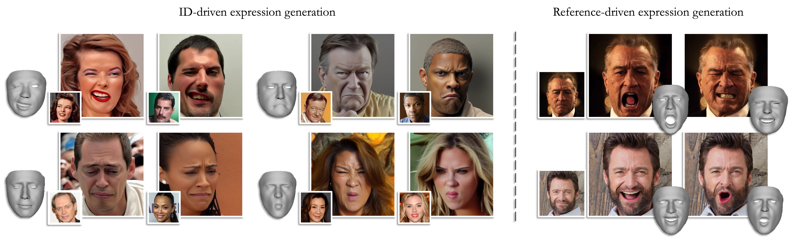

<div align="center">

## 🚀 NEW (2025): ID-Consistent, Precise Expression Generation with Blendshape-Guided Diffusion

📄 **Check out our latest extension!**  
We introduce a fine-grained **Expression Adapter**, enabling Arc2Face to generate any subject under any facial expression (even rare, asymmetric, subtle, or extreme ones). See details [below](#arc2face--expression-adapter).

<a href='http://arxiv.org/abs/2510.04706'></a>
<a href='https://huggingface.co/FoivosPar/Arc2Face'></a>


---

# Arc2Face: A Foundation Model for ID-Consistent Human Faces

[Foivos Paraperas Papantoniou](https://foivospar.github.io/)<sup>1</sup> &emsp; [Alexandros Lattas](https://alexlattas.com/)<sup>1</sup> &emsp; [Stylianos Moschoglou](https://moschoglou.com/)<sup>1</sup>   

[Jiankang Deng](https://jiankangdeng.github.io/)<sup>1</sup> &emsp; [Bernhard Kainz](https://bernhard-kainz.com/)<sup>1,2</sup> &emsp; [Stefanos Zafeiriou](https://www.imperial.ac.uk/people/s.zafeiriou)<sup>1</sup>  

<sup>1</sup>Imperial College London, UK <br>
<sup>2</sup>FAU Erlangen-Nürnberg, Germany

<a href='https://arc2face.github.io/'></a>
<a href='https://arxiv.org/abs/2403.11641'></a>
<a href='https://huggingface.co/spaces/FoivosPar/Arc2Face'></a>
<a href='https://huggingface.co/FoivosPar/Arc2Face'></a>
<a href='https://huggingface.co/datasets/FoivosPar/Arc2Face'></a>

</div>

This is the official implementation of **[Arc2Face](https://arc2face.github.io/)**, an ID-conditioned face model:

&emsp;✅ that generates high-quality images of any subject given only its ArcFace embedding, within a few seconds<br>
&emsp;✅ trained on the large-scale WebFace42M dataset offers superior ID similarity compared to existing models<br>
&emsp;✅ built on top of Stable Diffusion, can be extended to different input modalities, e.g. with ControlNet<br>


# News/Updates
[](https://paperswithcode.com/sota/diffusion-personalization-tuning-free-on?p=arc2face-a-foundation-model-of-human-faces)

- [2025/10/07] 🔥 We release an extension for accurate and ID-consistent facial expression transfer. See details [below](#arc2face--expression-adapter)!
- [2024/08/16] 🔥 Accepted to ECCV24 as an **oral**!
- [2024/08/06] 🔥 ComfyUI support available at [caleboleary/ComfyUI-Arc2Face](https://github.com/caleboleary/ComfyUI-Arc2Face)!
- [2024/04/12] 🔥 We add LCM-LoRA support for even faster inference (check the details [below](#lcm-lora-acceleration)).
- [2024/04/11] 🔥 We release the training dataset on [HuggingFace Datasets](https://huggingface.co/datasets/FoivosPar/Arc2Face).
- [2024/03/31] 🔥 We release our demo for pose control using Arc2Face + ControlNet (see instructions [below](#arc2face--controlnet-pose)).
- [2024/03/28] 🔥 We release our Gradio [demo](https://huggingface.co/spaces/FoivosPar/Arc2Face) on HuggingFace Spaces (thanks to the HF team for their free GPU support)!
- [2024/03/14] 🔥 We release Arc2Face.

# Installation
```bash
conda create -n arc2face python=3.10
conda activate arc2face

# Install requirements
pip install -r requirements.txt
```

# Download Models
1) The models can be downloaded manually from [HuggingFace](https://huggingface.co/FoivosPar/Arc2Face) or using python:
```python
from huggingface_hub import hf_hub_download

hf_hub_download(repo_id="FoivosPar/Arc2Face", filename="arc2face/config.json", local_dir="./models")
hf_hub_download(repo_id="FoivosPar/Arc2Face", filename="arc2face/diffusion_pytorch_model.safetensors", local_dir="./models")
hf_hub_download(repo_id="FoivosPar/Arc2Face", filename="encoder/config.json", local_dir="./models")
hf_hub_download(repo_id="FoivosPar/Arc2Face", filename="encoder/pytorch_model.bin", local_dir="./models")
```

2) For face detection and ID-embedding extraction, manually download the [antelopev2](https://github.com/deepinsight/insightface/tree/master/python-package#model-zoo) package ([direct link](https://drive.google.com/file/d/18wEUfMNohBJ4K3Ly5wpTejPfDzp-8fI8/view)) and place the checkpoints under `models/antelopev2`. 

3) We use an ArcFace recognition model trained on WebFace42M. Download `arcface.onnx` from [HuggingFace](https://huggingface.co/FoivosPar/Arc2Face) and put it in `models/antelopev2` or using python:
```python
hf_hub_download(repo_id="FoivosPar/Arc2Face", filename="arcface.onnx", local_dir="./models/antelopev2")
```
4) Then **delete** `glintr100.onnx` (the default backbone from insightface).

The `models` folder structure should finally be:
```
  . ── models ──┌── antelopev2
                ├── arc2face
                └── encoder
```

# Usage

Load pipeline using [diffusers](https://huggingface.co/docs/diffusers/index):
```python
from diffusers import (
    StableDiffusionPipeline,
    UNet2DConditionModel,
    DPMSolverMultistepScheduler,
)

from arc2face import CLIPTextModelWrapper, project_face_embs

import torch
from insightface.app import FaceAnalysis
from PIL import Image
import numpy as np

# Arc2Face is built upon SD1.5
# The repo below can be used instead of the now deprecated 'runwayml/stable-diffusion-v1-5'
base_model = 'stable-diffusion-v1-5/stable-diffusion-v1-5'

encoder = CLIPTextModelWrapper.from_pretrained(
    'models', subfolder="encoder", torch_dtype=torch.float16
)

unet = UNet2DConditionModel.from_pretrained(
    'models', subfolder="arc2face", torch_dtype=torch.float16
)

pipeline = StableDiffusionPipeline.from_pretrained(
        base_model,
        text_encoder=encoder,
        unet=unet,
        torch_dtype=torch.float16,
        safety_checker=None
    )
```
You can use any SD-compatible schedulers and steps, just like with Stable Diffusion. By default, we use `DPMSolverMultistepScheduler` with 25 steps, which produces very good results in just a few seconds.
```python
pipeline.scheduler = DPMSolverMultistepScheduler.from_config(pipeline.scheduler.config)
pipeline = pipeline.to('cuda')
```
Pick an image and extract the ID-embedding:
```python
app = FaceAnalysis(name='antelopev2', root='./', providers=['CUDAExecutionProvider', 'CPUExecutionProvider'])
app.prepare(ctx_id=0, det_size=(640, 640))

img = np.array(Image.open('assets/examples/joacquin.png'))[:,:,::-1]

faces = app.get(img)
faces = sorted(faces, key=lambda x:(x['bbox'][2]-x['bbox'][0])*(x['bbox'][3]-x['bbox'][1]))[-1]  # select largest face (if more than one detected)
id_emb = torch.tensor(faces['embedding'], dtype=torch.float16)[None].cuda()
id_emb = id_emb/torch.norm(id_emb, dim=1, keepdim=True)   # normalize embedding
id_emb = project_face_embs(pipeline, id_emb)    # pass through the encoder
```

<div align="center">

</div>

Generate images:
```python
num_images = 4
images = pipeline(prompt_embeds=id_emb, num_inference_steps=25, guidance_scale=3.0, num_images_per_prompt=num_images).images
```
<div align="center">

</div>

# LCM-LoRA acceleration

[LCM-LoRA](https://arxiv.org/abs/2311.05556) allows you to reduce the sampling steps to as few as 2-4 for super-fast inference. Just plug in the pre-trained distillation adapter for SD v1.5 and switch to `LCMScheduler`:
```python
from diffusers import LCMScheduler

pipeline.load_lora_weights("latent-consistency/lcm-lora-sdv1-5")
pipeline.scheduler = LCMScheduler.from_config(pipeline.scheduler.config)
```
Then, you can sample with as few as 2 steps (and disable `guidance_scale` by using a value of 1.0, as LCM is very sensitive to it and even small values lead to oversaturation):
```python
images = pipeline(prompt_embeds=id_emb, num_inference_steps=2, guidance_scale=1.0, num_images_per_prompt=num_images).images
```
Note that this technique accelerates sampling in exchange for a slight drop in quality.

# Start a local gradio demo
You can start a local demo for inference by running:
```bash
python gradio_demo/app.py
```

# Arc2Face + ControlNet (pose)
<div align="center">

</div>

We provide a ControlNet model trained on top of Arc2Face for pose control. We use [EMOCA](https://github.com/radekd91/emoca) for 3D pose extraction. To run our demo, follow the steps below:
### 1) Download Model
Download the ControlNet checkpoint manually from [HuggingFace](https://huggingface.co/FoivosPar/Arc2Face) or using python:
```python
from huggingface_hub import hf_hub_download

hf_hub_download(repo_id="FoivosPar/Arc2Face", filename="controlnet/config.json", local_dir="./models")
hf_hub_download(repo_id="FoivosPar/Arc2Face", filename="controlnet/diffusion_pytorch_model.safetensors", local_dir="./models")
```
### 2) Pull EMOCA
```bash
git submodule update --init external/emoca
```
### 3) Installation
This is the most tricky part. You will need PyTorch3D to run EMOCA. As its installation may cause conflicts, we suggest to follow the process below:
1) Create a new environment and start by installing PyTorch3D with GPU support first (follow the official [instructions](https://github.com/facebookresearch/pytorch3d/blob/main/INSTALL.md)).
2) Add Arc2Face + EMOCA requirements with:
```bash
pip install -r requirements_controlnet.txt
```
3) Install EMOCA code:
```bash
pip install -e external/emoca
```
4) Finally, you need to download the EMOCA/FLAME assets. Run the following and follow the instructions in the terminal:
```bash
cd external/emoca/gdl_apps/EMOCA/demos 
bash download_assets.sh
cd ../../../../..
```
### 4) Start a local gradio demo
You can start a local ControlNet demo by running:
```bash
python gradio_demo/app_controlnet.py
```

# Arc2Face + Expression Adapter

Our extension ["ID-Consistent, Precise Expression Generation with Blendshape-Guided Diffusion"](http://arxiv.org/abs/2510.04706) combines Arc2Face with a custom IP-Adapter designed for generating ID-consistent images with precise expression control based on FLAME blendshape parameters. We also provide an optional Reference Adapter which can be used to condition the output directly on the input image, i.e. preserving the subject's appearance and background (to an extent). You can find more details in the report.

<div align="center">

</div>

<br>
Here's how to run it:

### 1) Download Model
Download the Expression and Reference Adapters manually from [HuggingFace](https://huggingface.co/FoivosPar/Arc2Face) or using python:
```python
from huggingface_hub import hf_hub_download

hf_hub_download(repo_id="FoivosPar/Arc2Face", filename="exp_adapter/exp_adapter.bin", local_dir="./models")
hf_hub_download(repo_id="FoivosPar/Arc2Face", filename="ref_adapter/pytorch_lora_weights.safetensors", local_dir="./models")
```
### 2) Download third-party models (SMIRK)
We use the [SMIRK](https://github.com/georgeretsi/smirk) method to extract FLAME expression parameters from the target image. Download the required checkpoints **face_landmarker.task** and **SMIRK_em1.pt** and put them under `models/smirk`:
```bash
mkdir models/smirk
wget https://storage.googleapis.com/mediapipe-models/face_landmarker/face_landmarker/float16/latest/face_landmarker.task --directory-prefix models/smirk
pip install gdown
gdown --id 1T65uEd9dVLHgVw5KiUYL66NUee-MCzoE -O models/smirk/
```
### 3) Start a local gradio demo
Then, just run the demo and follow the instructions:
```bash
python gradio_demo/app_exp_adapter.py
```

# Test Data
The test images used for comparisons in the paper (Synth-500, AgeDB) are available [here](https://drive.google.com/drive/folders/1exnvCECmqWcqNIFCck2EQD-hkE42Ayjc?usp=sharing). Please use them only for evaluation purposes and make sure to cite the corresponding [sources](https://ibug.doc.ic.ac.uk/resources/agedb/) when using them.

# Community Resources

### Replicate Demo
- [Demo link](https://replicate.com/camenduru/arc2face) by [@camenduru](https://github.com/camenduru).

### ComfyUI
- [caleboleary/ComfyUI-Arc2Face](https://github.com/caleboleary/ComfyUI-Arc2Face) by [@caleboleary](https://github.com/caleboleary).
  
### Pinokio
- Pinokio [implementation](https://pinokio.computer/item?uri=https://github.com/cocktailpeanutlabs/arc2face) by [@cocktailpeanut](https://github.com/cocktailpeanut) (runs locally on all OS - Windows, Mac, Linux).

# Acknowledgements
- Thanks to the creators of Stable Diffusion and the HuggingFace [diffusers](https://github.com/huggingface/diffusers) team for the awesome work ❤️.
- Thanks to the WebFace42M creators for providing such a million-scale facial dataset ❤️.
- Thanks to the HuggingFace team for their generous support through the community GPU grant for our demo ❤️.
- We also acknowledge the invaluable support of the HPC resources provided by the Erlangen National High Performance Computing Center (NHR@FAU) of the Friedrich-Alexander-Universität Erlangen-Nürnberg (FAU), which made the training of Arc2Face possible.

# Citation
If you find Arc2Face useful for your research, please consider citing us:

```bibtex
@inproceedings{paraperas2024arc2face,
      title={Arc2Face: A Foundation Model for ID-Consistent Human Faces}, 
      author={Paraperas Papantoniou, Foivos and Lattas, Alexandros and Moschoglou, Stylianos and Deng, Jiankang and Kainz, Bernhard and Zafeiriou, Stefanos},
      booktitle={Proceedings of the European Conference on Computer Vision (ECCV)},
      year={2024}
}
```
Additionally, if you use the Expression Adapter, please also cite the extension:

```bibtex
@inproceedings{paraperas2025arc2face_exp,
      title={ID-Consistent, Precise Expression Generation with Blendshape-Guided Diffusion}, 
      author={Paraperas Papantoniou, Foivos and Zafeiriou, Stefanos},
      booktitle={Proceedings of the IEEE/CVF International Conference on Computer Vision (ICCV) Workshops},
      year={2025}
}
```
